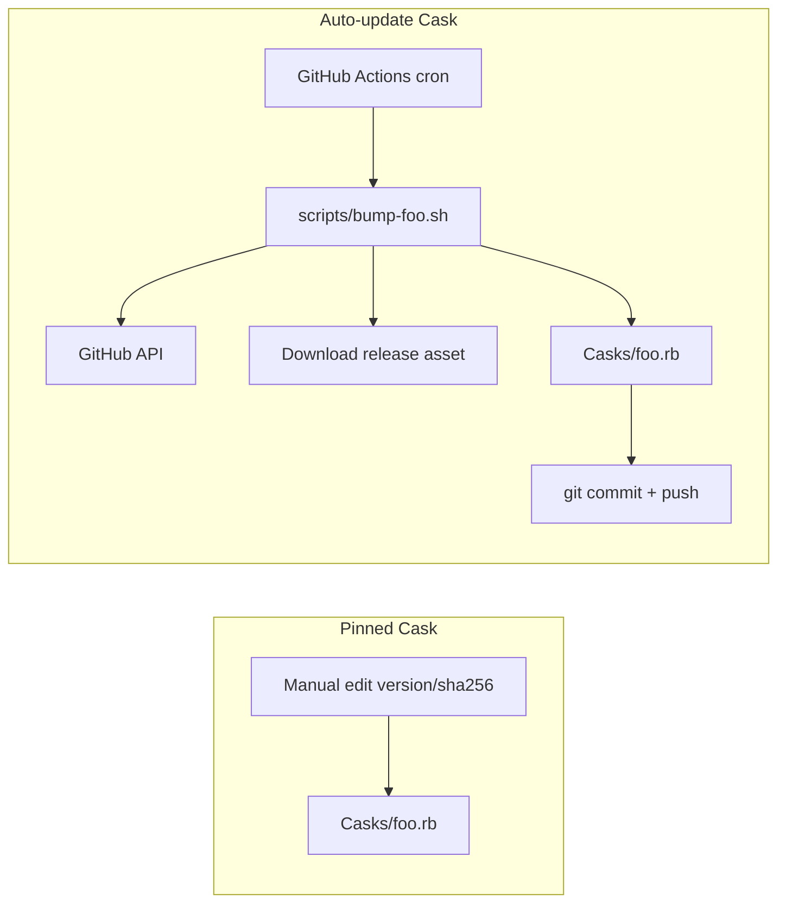

# Adding Software to homebrew-software

Guide for adding new casks to this tap.  
向本 tap 添加新软件的规范文档。

---

## 1. Software Categories / 软件分类

### Pinned（固定版本）

Use when you need to **lock a specific version** — e.g. a legacy release, vendor URL with a fixed filename, or software that broke in newer versions.

适用场景：需要**锁定特定版本**，例如保留旧版、vendor 固定下载地址、新版本不兼容等。

- Version and `sha256` are updated **manually**
- Optional `livecheck` for `brew outdated` reminders only (does not auto-bump)
- Template: [`templates/Cask.pinned.rb.template`](../templates/Cask.pinned.rb.template)
- Example: [`Casks/textsniper-old.rb`](../Casks/textsniper-old.rb)

### Auto-update（自动更新）

Use when upstream publishes **GitHub Releases** (or similar) with predictable asset names.

适用场景：上游通过 **GitHub Releases** 发布，且 asset 命名规律可预测。

- CI script downloads the latest release, recomputes `sha256`, commits to `main`
- Templates:
  - [`templates/Cask.github-release.rb.template`](../templates/Cask.github-release.rb.template)
  - [`templates/bump-github-release.sh.template`](../templates/bump-github-release.sh.template)
  - [`templates/workflow-bump.yml.template`](../templates/workflow-bump.yml.template)
- Example: [`Casks/next-ai-draw-io.rb`](../Casks/next-ai-draw-io.rb)

---

## 2. Naming Conventions / 命名约定

| Rule | Example |
|------|---------|
| Cask token: lowercase, hyphens | `next-ai-draw-io` |
| Filename matches token | `Casks/next-ai-draw-io.rb` |
| `-old` suffix = intentionally pinned legacy | `textsniper-old` |
| Bump script | `scripts/bump-<token>.sh` |
| Workflow | `.github/workflows/bump-<token>.yml` |

---

## 3. Required Cask Stanzas / 必填项

Every cask must include:

```ruby
cask "token" do
  version "x.y.z"
  sha256 "..."           # or sha256 arm: "..." for arch-specific
  url "...", verified: "domain/"
  name "Display Name"
  desc "One-line description"
  homepage "https://..."
  app "AppName.app"
end
```

---

## 4. Recommended Stanzas / 推荐项

```ruby
livecheck do
  url :url
  strategy :github_latest   # GitHub releases
end

depends_on macos: :monterey  # minimum macOS version (symbol form)

auto_updates true            # only if the app has its own update mechanism (Sparkle, etc.)
```

### `depends_on macos:` — DO NOT use deprecated syntax

```ruby
# BAD — deprecated, triggers brew update warnings
depends_on macos: ">= :monterey"

# GOOD — minimum macOS version
depends_on macos: :monterey
```

Valid symbols: `:catalina`, `:big_sur`, `:monterey`, `:ventura`, `:sonoma`, `:sequoia`, etc.

---

## 5. livecheck Strategies / livecheck 策略

| Upstream | Strategy | Notes |
|----------|----------|-------|
| GitHub Releases | `:github_latest` on `url :url` | Best for auto-update casks |
| Vendor redirect / header | `:header_match` | Reads version from response headers |
| Vendor API | Custom `url` + `:json` / `:page_match` | Depends on vendor |

`livecheck` does **not** update the cask file automatically. Only the bump script + CI does that for auto-update casks.

---

## 6. Adding a Pinned Cask / 添加固定版本软件

1. Copy `templates/Cask.pinned.rb.template` → `Casks/<token>.rb`
2. Replace all `{{PLACEHOLDERS}}`
3. Download the DMG and compute SHA256:
   ```bash
   shasum -a 256 /path/to/App.dmg
   ```
4. Run local validation (see §9)
5. Commit and push

No CI workflow needed.

---

## 7. Adding an Auto-update Cask / 添加自动更新软件

### Step 1 — Create the cask

1. Copy `templates/Cask.github-release.rb.template` → `Casks/<token>.rb`
2. Fill in placeholders; verify the release asset URL pattern matches upstream

### Step 2 — Create the bump script

1. Copy `templates/bump-github-release.sh.template` → `scripts/bump-<token>.sh`
2. Configure `REPO`, `ASSET_PREFIX`, `ARCH_SUFFIX`, `TAG_PREFIX`
3. Make executable: `chmod +x scripts/bump-<token>.sh`
4. Test locally:
   ```bash
   GITHUB_TOKEN=ghp_xxx ./scripts/bump-<token>.sh   # with token (recommended)
   ./scripts/bump-<token>.sh                         # without token (rate-limited)
   ```

### Step 3 — Create the CI workflow

1. Copy `templates/workflow-bump.yml.template` → `.github/workflows/bump-<token>.yml`
2. Replace `{{TOKEN}}`, `{{CASK_PATH}}`, `{{CRON}}`
3. **Must** pass `GITHUB_TOKEN` to the bump step (avoids API 403 / rate limits)

### CI requirements / CI 要求

- `GITHUB_TOKEN: ${{ secrets.GITHUB_TOKEN }}` in the bump step env
- Bump script must validate HTTP responses before JSON parsing
- Skip commit when version is unchanged (early exit in script)
- Direct push to `main` (current policy for this tap)

---

## 8. Architecture / 架构说明



---

## 9. Local Validation / 本地验证

Run from the tap directory after `brew tap`:

```bash
# Strict audit
brew audit --cask --strict chanochli/software/<token>

# Check livecheck
brew livecheck --cask <token>

# Test install (optional, installs the app)
brew install --cask <token>
```

For auto-update bump scripts:

```bash
# Should exit 0 with "Already at version" if up to date
./scripts/bump-<token>.sh

# With auth (avoids 403 on shared IPs)
GITHUB_TOKEN=$(gh auth token) ./scripts/bump-<token>.sh
```

---

## 10. Checklist / 新增软件检查清单

### All casks

- [ ] Token is lowercase with hyphens; filename matches token
- [ ] `version`, `sha256`, `url` (with `verified:`), `name`, `desc`, `homepage`, `app` are set
- [ ] `depends_on macos: :symbol` (not `">= :symbol"`)
- [ ] `brew audit --cask --strict` passes
- [ ] `brew livecheck --cask <token>` works

### Pinned only

- [ ] Version is intentionally locked; reason documented in commit or cask comment if non-obvious
- [ ] SHA256 matches the pinned DMG

### Auto-update only

- [ ] Bump script created from template with correct `REPO` / asset naming
- [ ] Bump script is executable (`chmod +x`)
- [ ] Workflow passes `GITHUB_TOKEN`
- [ ] Cron schedule documented in workflow comment
- [ ] Tested bump script locally (with `GITHUB_TOKEN` if possible)
- [ ] Commit message format: `cask(<token>): bump to vX.Y.Z`

---

## Reference / 参考

- [Homebrew Cask Cookbook](https://docs.brew.sh/Cask-Cookbook)
- [Homebrew livecheck documentation](https://docs.brew.sh/Brew-Livecheck)
- Existing examples in this tap:
  - Pinned: [`Casks/textsniper-old.rb`](../Casks/textsniper-old.rb)
  - Auto-update: [`Casks/next-ai-draw-io.rb`](../Casks/next-ai-draw-io.rb), [`scripts/bump-next-ai-draw-io.sh`](../scripts/bump-next-ai-draw-io.sh)
